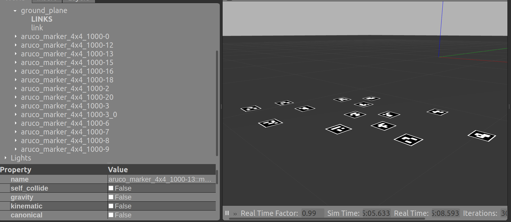

### Aruco marker Gazebo models 

- **Dictionary** DICT_4x4_50 
- **Side** 80.6 mm
- **IDs** 0, 2, 3, 6, 7, 8, 9, 12, 13, 15, 16, 18, 20


 To use, update `GAZEBO_MODEL_PATH` in .bashrc


```
export GAZEBO_MODEL_PATH=${GAZEBO_MODEL_PATH}:<path-to-KinDynFusion>/gazebo/models
```


